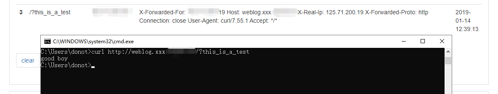
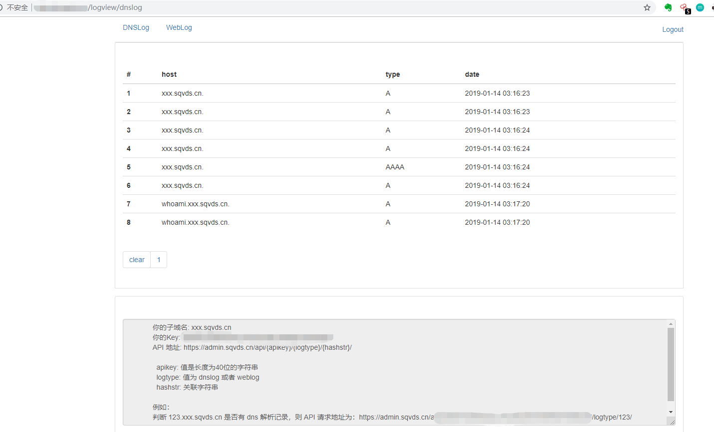

```
 ____  _   _ ____  _
|  _ \| \ | / ___|| |    ___   __ _
| | | |  \| \___ \| |   / _ \ / _` |
| |_| | |\  |___) | |__| (_) | (_| |
|____/|_| \_|____/|_____\___/ \__, |
                              |___/
```

简介
---

本版本是对原四叶草 BugscanTeam 打造的监控 DNS 解析记录和 HTTP 访问记录的工具DNSLog的修改版本。遵循GPL2。
因为原始版本是好几年前开发，一些功能不满足我的需求，因此在源版本基础上进行了重新编码，修改了数据结构、Weblog记录、API等。

安装（Docker）
---

1. 环境准备
Docker环境

2. 获取源代码
```
git clone https://github.com/donot-wong/dnslog.git
``` 

3. 修改配置
首先需要准备两个域名，一个做dns服务域名(如dns.com)，一个做dnslog/weblog记录域名(如example.cn)，一个部署服务的公网ip(120.24.224.32)
	1. 在dns.com域名的解析记录中增加两条A记录
		ns1.dns.com 120.24.224.32
		ns2.dns.com 120.24.224.32
	2. 在域名注册商处修改example.cn的dns server为ns1.dns.com和ns2.dns.com

```
\dnslog\settings.py

ALLOWED_HOSTS = ['.example.cn'] # 域名

...
DNS_DOMAIN = 'example.cn'
ADMIN_DOMAIN = 'admin.example.cn' # 后台域名

NS1_DOMAIN = 'ns1.dns.com' # dns服务1
NS2_DOMAIN = 'ns2.dns.com' # dns服务2

SERVER_IP = '120.24.224.32' # 外网ip
```

4. 编译镜像
```
cd dnslog
sudo docker build -t dnslog:v1 .
```

5. 启动服务
```
sudo docker run --name dnslog -d -p 53:53/udp -p 127.0.0.1:8082:8000 dnslog:v1
```

6. 配置nginx反向代理
```
server {
	#listen 443 ssl;
	#listen [::]:443 ssl;
	listen 80;
	server_name *.sqvds.cn;

	index index.html index.htm index.nginx-debian.html;
	ssl_certificate ssl/dnslog/1722485_admin.sqvds.cn.pem;
	ssl_certificate_key ssl/dnslog/1722485_admin.sqvds.cn.key;
	ssl_session_timeout 5m;
	ssl_protocols TLSv1 TLSv1.1 TLSv1.2;
	ssl_ciphers ECDHE-RSA-AES128-GCM-SHA256:HIGH:!aNULL:!MD5:!RC4:!DHE;
	ssl_prefer_server_ciphers on;
	access_log /var/log/nginx/dnslog-access.log;
	error_log /var/log/nginx/dnslog-error.log;
	location / {
		client_max_body_size 100m;
		proxy_set_header X-Forwarded-For $proxy_add_x_forwarded_for;
		proxy_set_header Host $http_host;
		proxy_set_header X-Real-IP $remote_addr;
		proxy_set_header X-Forwarded-Proto $scheme;
		proxy_pass http://127.0.0.1:8082;
	}

	location /static {
		alias /home/ubuntu/DNSLog/dnslog/static;
	}
}
```

使用效果
---

1. 默认密码
donot/123456

2. 修改密码
可通过后台或使用Django命令行进行修改

```
sudo docker exec -it dnslog /bin/bash
cd /usr/src/app
python manage.py changepassword donot
```

3. 记录weblog
donot用户默认二级域名前缀为xxx，即访问{data}.xxx.example.cn记录下的内容对donot用户才可见，非xxx二级域名记录的log对donot用户不可见，一个用户对应一个二级域名
```
curl http://weblog.xxx.example.cn/?this_is_a_test
```


4. 记录dnslog
donot用户默认二级域名前缀为xxx，即{data}.xxx.example.cn的解析记录对donot用户可见，非xxx二级域名下级dns解析log对donot用户不可见


4. 界面
